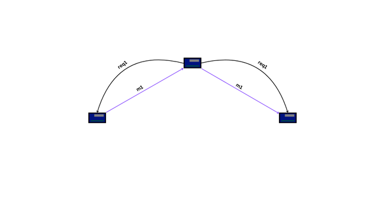

# IOT_nRF24
## Descrição do Projeto
Desenvolvimento de uma aplicação IoT utilizando Arduino Nano e módulos de rádio nRF24, com integração a uma página web para monitoramento e controle dos dispositivos.

## Objetivo
- Implementar uma rede com 3 dispositivos:
    - 1 nó gateway.
    - 2 nós que trocam dados entre si.
    
    
- Definir um protocolo de comunicação adequado à aplicação escolhida.
- Exibir os dados coletados ou permitir o controle dos nós por meio de uma interface web.

## Equipe: 
    - Matheus Vinicius Costa
    - Caio Borba
    - João Bonilha

