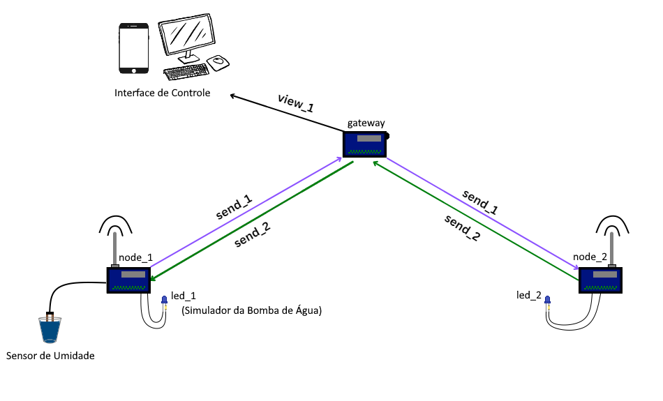

# IOT_nRF24
## Descrição do Projeto
Desenvolvimento de uma aplicação IoT utilizando **Arduino Nano** e módulos de rádio **nRF24** para monitoramento e controle de um sistema de irrigação automatizado. A aplicação integra um sensor de umidade do solo e um LED que simula o acionamento de uma bomba de água. O controle e monitoramento são realizados através de uma interface web.

## Objetivo
### Implementar uma rede IoT:

- **Nó 1 (Sensor):** Leitura da umidade do solo e envio dos dados ao gateway.
- **Nó 2 (Atuador):** Controle da bomba de água, acionando ou desligando com base nos dados de umidade recebidos.
- **Gateway:** Central de comunicação responsável por:
    - Receber os dados do nó sensor.
    - Transmitir comandos de controle para o nó atuador.
    - Enviar os dados coletados para a interface web.
- **Interface Web:** Exibir os dados de umidade em tempo real e permitir o controle manual do sistema de irrigação, quando necessário.

## Equipe: 
    - Matheus Vinicius Costa
    - Caio Borba
    - João Bonilha

